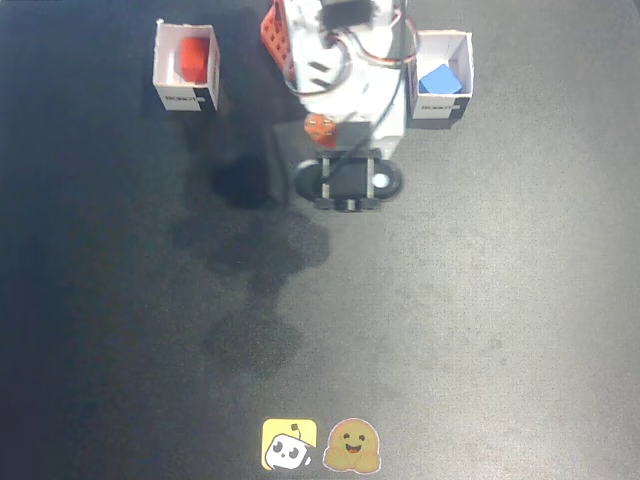
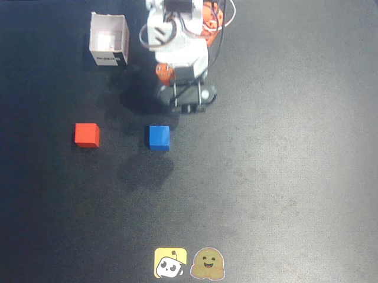
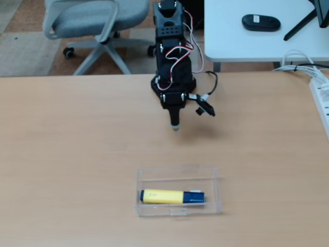
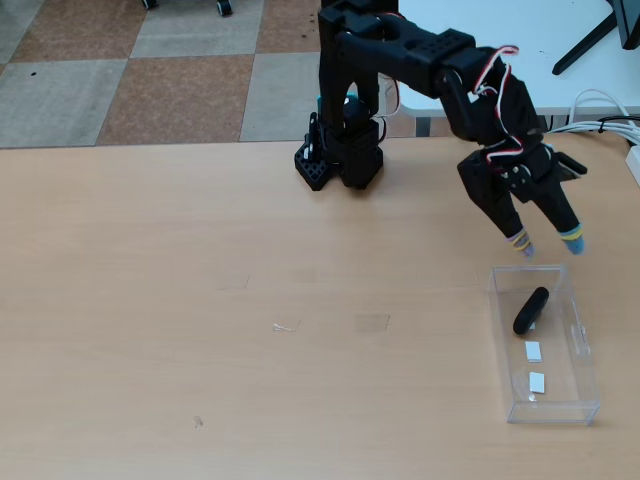

# 후속 조사 ③+⑤ — eval 도메인의 정체 (2026-07-18)

> 도구: `local_eval/eval_domain_probe.py` (킷 DINOv2 feature로 eval 216장 vs train 128 데이터셋 대표 프레임 512장 전수 대조 + eval 내부 클러스터링, feature 캐시 `eval_domain_probe.npz`)

## 결론
1. **eval은 train과 겹치는 장면이 하나도 없음** — 가장 닮은 것도 유사도 0.772, 같은 장면 판정선(0.85)을 넘는 게 **0장**. "eval은 100% 미공개 장면"으로 확정 → 장면을 외우는 전략은 무효, 처음 보는 장면에도 통하는 일반화가 정답임이 데이터로 확정.
2. **eval은 사실상 촬영 세트 2곳**: 무리 114장(sample ~000~153: 검은 매트 + LeRobot 판다/HF 스티커 + 흰색 SO-100, 위에서 내려다본 시점) + 58장(sample 154~215: 나무 책상 + 검은 SO-100, 옆 아래에서 올려다본 시점) = 80%. 나머지는 작은 무리(16/8/5/3)와 하나짜리 — 대부분 세트1의 변형(물체/조명 차이)으로 추정.
3. **eval 행동 분포 (③)**: 손목회전(wrist_roll)이 **모든 샘플에서 일관되게 +1.5σ**(표준편차의 1.5배)만큼 밀림 (90%가 +0.5σ 이상) — 일부 특이값이 아니라 eval 장비의 손목 장착 각도 자체가 다름. 어깨상하/팔꿈치는 평균은 비슷하나 흩어진 폭이 1.4~1.5배. **움직임 있는 구간만 골라 담음** (스텝당 중앙 1.9°, 거의 정지인 것 9/216) → 정지 영상류 꼼수는 Action에서 확실히 벌점.
4. 종합: **eval = 주최가 자체 세트 2곳에서 새로 촬영한 데이터** (설정에 남은 'top'(위쪽 카메라) 흔적·손목회전 밀림·장면 무겹침, 세 가지가 앞뒤 맞음).

## 셋업 예시 사진

**셋업 A** (114장+변형, sample ~000–153): 검은 매트 + LeRobot 판다/HF 스티커 + 흰색 SO-100, top-down 뷰

| sample_000000 | sample_000100 |
|---|---|
|  |  |

**셋업 B** (58장, sample 154–215): 나무 책상 + 검은 SO-100 + 아크릴 상자, 측면 상향 뷰

| sample_000154 | sample_000215 |
|---|---|
|  |  |

## 가장 가까운 train "사촌" (스타일만 닮고 장소는 다름 — 큐레이션·홀드아웃 힌트)
- 세트1(검은 매트) 사촌: `aractingi/push_cube_offline_data` (유사도 ~0.72-0.77, 검은 매트+스티커)
- 세트2(나무 책상+검은 팔) 사촌: `Loki0929/so100_duck` (유사도 ~0.72-0.77), `frk2/so100large`

## 전략 반영
- **홀드아웃**: 처음 보는 장면(unseen) 구간에 "eval 사촌형" 데이터셋(위에서 본 검은매트형/나무책상형)이 들어가도록 검토 — 지금의 무작위 7개를 사촌형 위주로 교체할 가치. (변경 시 분할 다시 고정·기록 필수)
- **학습 큐레이션**: 사촌형 데이터셋을 더 많이 학습(오버샘플링) 후보. 단 겹침이 없으니 특정 장면 암기가 아니라 "시점 스타일 적응"이 목적.
- **자체 IDM(surrogate)**: 추출기가 잘 맞는 도메인(08)과 eval 2개 세트가 겹치는지 확인이 다음 단계 — 추출기 신뢰도 지도(128 데이터셋 자가시험)와 이 결과를 합쳐본다.
- **손목회전(wrist_roll)**: eval 입력을 train 통계로 z-정규화하면 손목회전이 늘 +1.5 부근 → 모델이 이 영역을 잘 못 그리면 Action의 손목회전 차원에서 감점이 몰릴 수 있음. 학습 중 손목회전 큰 값 구간을 더 많이 학습하는 것 검토.

## 한계
- train 대표 프레임은 데이터셋당 4 에피소드의 첫 프레임만 (한 데이터셋에 여러 장면이 있으면 놓칠 수 있으나, 최대 유사도 0.77 vs 판정선 0.85 차이가 커서 결론이 뒤집힐 가능성은 낮음).
- 무리 나누기 기준(유사도 ≥0.85)은 DINO 특징 기준 — 조명·물체 변화에 민감해 세트 개수를 실제보다 많게 셀 수 있음 (세트 2곳이라는 결론엔 영향 없음).
