# A/B 액션 테스트 — 2026-08-09

액션만 바꿨을 때 생성물이 달라지는지 보기 위해 뽑은 그림 모음. **각 그림이 무엇인지만 적는다.**

모든 그림은 **16프레임을 8×2 격자로 편 것**이다. 윗줄이 프레임 0~7, 아랫줄이 8~15.
가로 방향 검은 띠는 원본이 4:3인데 320×512 레터박스로 맞추면서 생긴 여백이다.

## 쓰인 체크포인트

| 이름 | 학습 데이터 | 누적 스텝 |
|---|---|---|
| **base-02 600** | 전체 123개 데이터셋 (8,977 클립) | 900 |
| **base-03 300** | duck 1개 (285 클립, 17에폭) | 1,200 |
| **base-03 600** | duck 1개 (285 클립, 33에폭) | 1,500 |

셋 다 인코더(`input_blocks` 447M) 동결, 디코더+middle 994M 학습, lr 1e-5, 유효배치 16.
base-03 은 base-02 300 에서 이어받았다.

---

## 1. A/B 설계

같은 클립(`Loki0929/so100_duck` 홀드아웃 `val[0]`)으로 세 경우를 만든다.
**조건 이미지 1장과 액션 16×12 만 바꾸고 나머지는 전부 같다**(시드 포함).

| | 조건 이미지 | 액션 | 대응하는 정답 |
|---|---|---|---|
| **A 정방향** | GT 프레임 **0** | 원래 순서 | GT |
| **B 되감기** | GT 프레임 **15** | **뒤집은 순서** | **되감은 GT** |
| **C 모순** | GT 프레임 **0** | 뒤집은 순서 | 없음 |

B 는 조건 이미지와 액션이 서로 맞고(둘 다 마지막 자세에서 출발), 관절 범위를 벗어나지 않으며,
**비교할 정답 영상이 존재한다**(GT 를 거꾸로 돌린 것). C 는 조건과 액션이 어긋난 입력이라
학습에서 본 적이 없다 — 대조군.

되감을 때는 **절대값만 뒤집고 Δ 는 다시 계산**한다(Δ 열을 그냥 뒤집으면 부호와 정렬이 어긋난다).

### 정답 두 개

| 원본 GT | 되감은 GT |
|---|---|
| 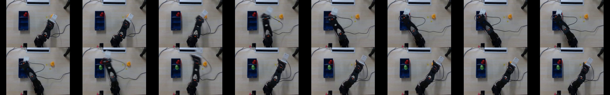 | 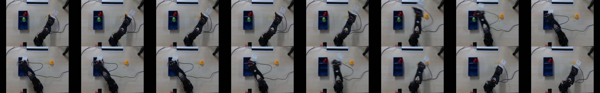 |

`val[0]` 의 궤적: 프레임 0~5 에 팔이 왼쪽·아래로 뻗고(pan 38°→−32°), 6~7 에 그리퍼가 0→31 로 열리고,
8~10 에 오른쪽으로 되돌아오고(pan −15°→33°), 11~15 는 제자리에서 그리퍼가 42→21 로 닫힌다.

### base-02 600 (전체 데이터셋)

| A 정방향 | B 되감기 | C 모순 |
|---|---|---|
| 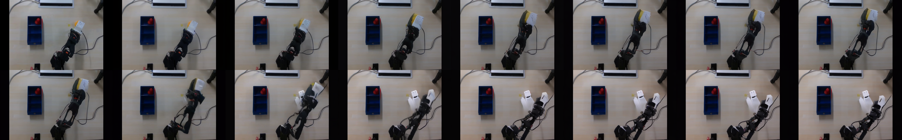 | 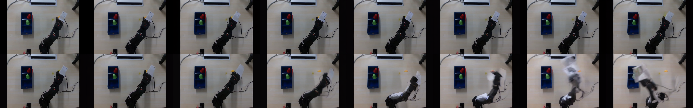 | 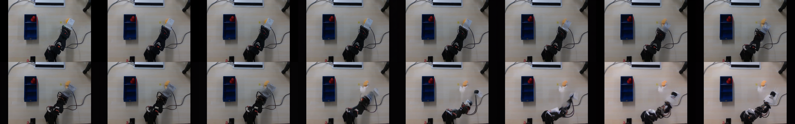 |

### base-03 300 (duck 단일, 17에폭)

| A 정방향 | B 되감기 |
|---|---|
| 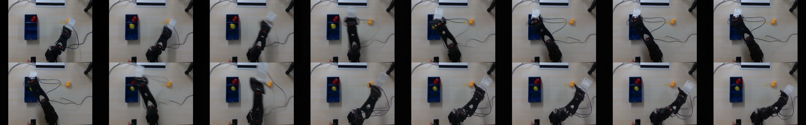 | 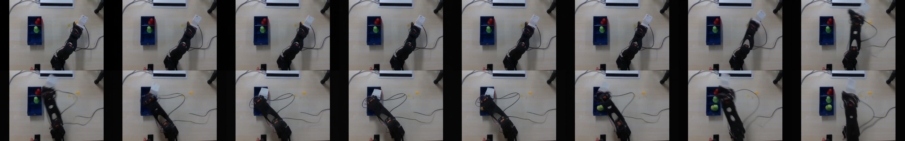 |

### base-03 600 (duck 단일, 33에폭)

| A 정방향 | B 되감기 | C 모순 |
|---|---|---|
| 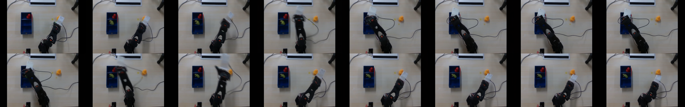 | 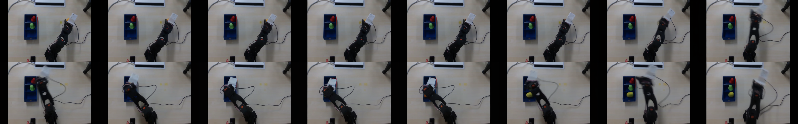 | 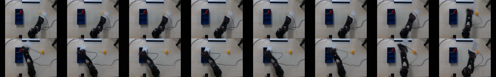 |

### 측정값

정답 MAE·움직임 모두 0~255 척도. **프레임간** = 이웃 프레임 차이의 평균, **누적변위** = 마지막 프레임과 첫 프레임의 차이.

| | 정답 MAE | 프레임간 | 누적변위 |
|---|---:|---:|---:|
| GT (= 되감은 GT) | — | 6.308 | 5.043 |
| base-02 600 · A | 16.345 | 5.136 | 16.884 |
| base-02 600 · B | 14.812 | 6.005 | 25.594 |
| base-03 300 · A | 8.134 | 7.121 | 11.778 |
| base-03 300 · B | 10.678 | 6.061 | 14.535 |
| base-03 600 · A | **6.280** | 6.543 | 5.606 |
| base-03 600 · B | 9.868 | 6.344 | 10.695 |

세 경우가 서로 얼마나 다른가 (MAE):

| | base-02 600 | base-03 300 | base-03 600 |
|---|---:|---:|---:|
| A vs B | 9.473 | 13.056 | 12.013 |
| A vs C | 7.998 | 11.859 | 10.825 |
| B vs C | 6.026 | 4.541 | 4.826 |

---

## 2. eval 추론 (base-03)

`sample_000000` 하나. base-03 은 duck 만 학습해서 eval 장면은 본 적이 없다.

| 300스텝 | 600스텝 |
|---|---|
| 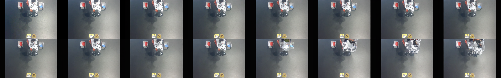 | 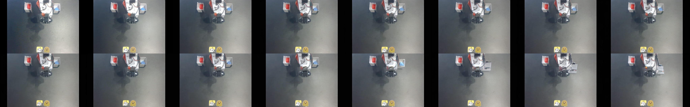 |

| | 프레임간 | 누적변위 |
|---|---:|---:|
| base-01 600 (전체) | 3.784 | 15.165 |
| base-02 300 (전체) | 3.599 | 11.280 |
| base-02 600 (전체) | 4.127 | 14.802 |
| base-03 300 (duck) | 3.578 | 15.400 |
| base-03 600 (duck) | 3.194 | 14.057 |

---

## 3. 다른 클립·다른 데이터셋 추론 (전부 base-03 600)

조건은 A 와 같다 — GT 첫 프레임 + 원래 순서 액션. **왼쪽이 GT, 오른쪽이 생성.**

### duck — 학습에 쓴 데이터셋의 홀드아웃 에피소드

| | GT | 생성 |
|---|---|---|
| val[1] | 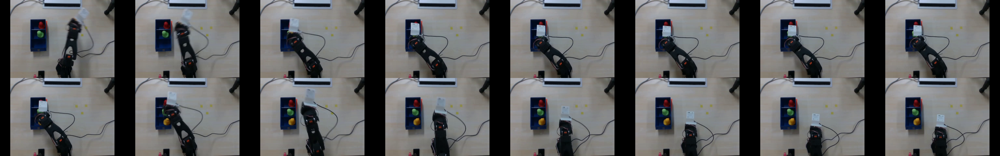 | 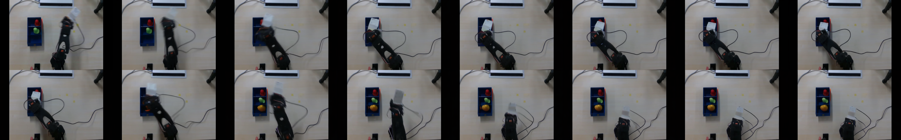 |
| val[5] | 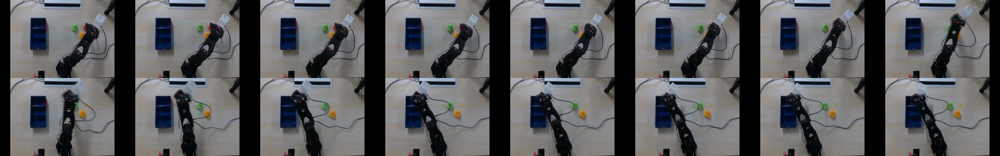 | 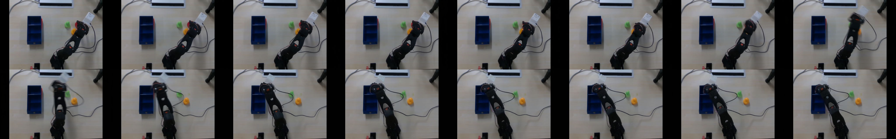 |
| val[9] | 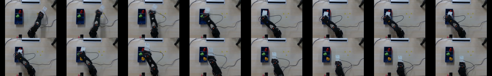 | 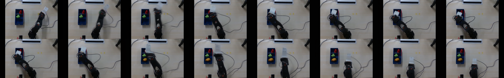 |

### pandaRQ/pick_med_1 — 학습에 안 쓴 데이터셋 (팔 하나, eval 유사도 1위)

| | GT | 생성 |
|---|---|---|
| val[0] | 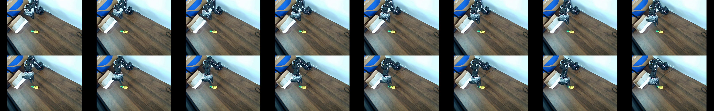 | 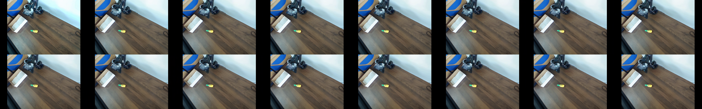 |
| val[1] | 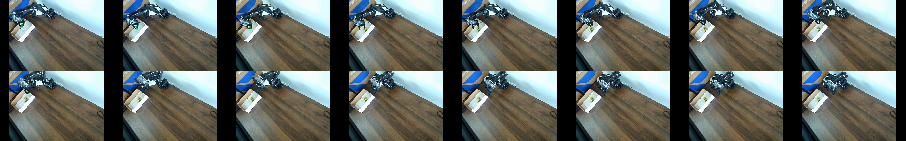 | 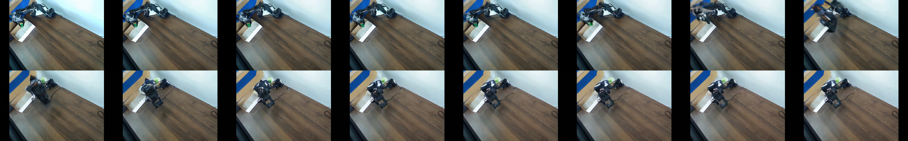 |
| val[3] | 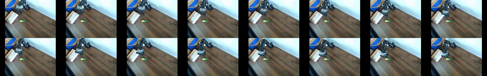 | 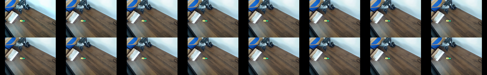 |

### roboticshack/left-arm-grasp-lego-brick — 학습에 안 쓴 데이터셋

화면에 팔이 둘로 보여 판독이 모호하다는 지적이 있어 pandaRQ 를 추가로 뽑았다.

| | GT | 생성 |
|---|---|---|
| val[0] | 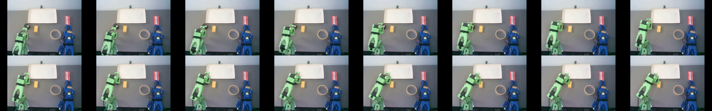 | 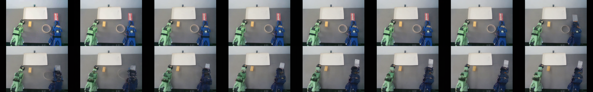 |
| val[1] | 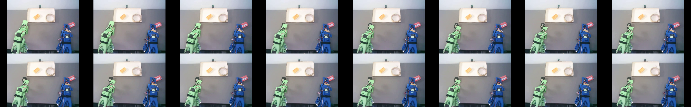 | 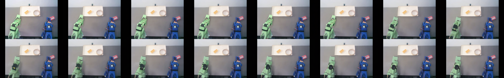 |
| val[3] | 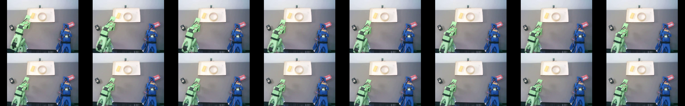 | 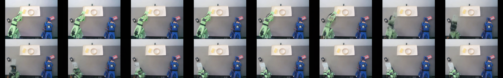 |

### 측정값

| 데이터셋 | 학습 사용 | 클립 | GT 프레임간 | 생성 프레임간 | GT 누적 | 생성 누적 | MAE |
|---|---|---|---:|---:|---:|---:|---:|
| duck | ○ | val[0] | 6.326 | 6.540 | 5.053 | 5.553 | 6.268 |
| | | val[1] | 5.040 | 5.878 | 9.921 | 10.212 | 6.608 |
| | | val[5] | 4.958 | 4.776 | 15.800 | 15.825 | 5.303 |
| | | val[9] | 5.611 | 6.388 | 10.227 | 10.648 | 6.695 |
| pandaRQ | ✕ | val[0] | 2.748 | 2.303 | 6.687 | 7.762 | 9.824 |
| | | val[1] | 3.239 | 4.235 | 7.468 | 15.262 | 13.222 |
| | | val[3] | 2.646 | 1.927 | 5.966 | 6.237 | 9.203 |
| roboticshack | ✕ | val[0] | 3.537 | 3.281 | 7.291 | 14.170 | 13.873 |
| | | val[1] | 1.819 | 2.462 | 5.501 | 9.875 | 9.564 |
| | | val[3] | 2.632 | 3.267 | 7.542 | 10.716 | 10.951 |

---

## 재현

```bash
# A/B (조건 이미지 + 액션 3종)
python base/abtest.py --config base/base-03.yaml --ckpt <ckpt> --idx 0 --out <출력>

# 클립·데이터셋 바꿔 추론 — dataset_paths 만 다른 config 를 쓴다
python base/peek.py --config base/base-03-panda.yaml --ckpt <ckpt> --train-idx 0,1,3 --no-ema --out <출력>
```

측정은 그리드 PNG 를 16프레임으로 잘라 계산했다(별도 mp4 불필요).
